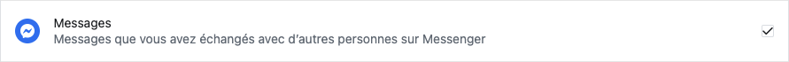
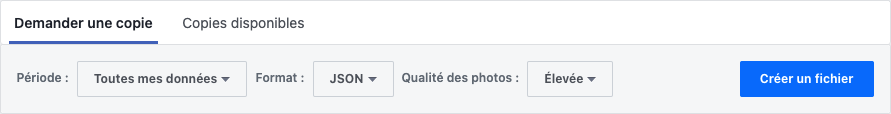

# Messenger Scraper

## :fr: Français

### 1. Objectif
Ce code JavaScript a pour objecif d'extraire des l'ensemble des photos et vidéos envoyées et reçues dans des disscussions sur Facebook Messenger.

En se basant sur la date d'envoi des photos/vidéos, les fichiers sont renommés avec date et heure. Cela permet de retrouver de façon aproximative le moment auquel a été prise la photo/vidéo

### 2. Demander l'historique à Facebook

- Se rendre sur ce lien [facebook.com/dyi/?referrer=yfi_settings](https://www.facebook.com/dyi/?referrer=yfi_settings)

- Sélectionner uniquement les messages



- Choisir le format JSON et créer le fichier



:warning:   Après cette étape il faut attendre de recevoir un  mail de Facebook indiquant que l'archive est prête

### 3. Télécharger l'archive

L'archive sera probablement divisée en plusieurs dossiers d'archives `.zip`.

Pour chacune de ces archives, récupérez le dossier `messages`, contenant `archived_threads` et `inbox`. L'objectif est d'obtenir l'arboressence suivante :

```
messages
│─ archived_threads
│  │- ...
│  └─ ... 
└─ inbox   
   │- ...
   └─ ... 
```

### 4. Extraire les conversations

Une fois extraits toutes les archives, il faut les placer dans le dossier du projet de la façon suivante :

```
messenger-scraper
│─ messages-1
│  │─ archived_threads
│  │  │- ...
│  │  └─ ... 
│  └─ inbox   
│     │- ...
│     └─ ... 
│
│─ messages-2
|  │- ...
│  └─ ...
│
│─ messages-{n}
│─ readme-assets
│─ .gitignore
│─ index.js
│─ LICENSE.md
│─ package.json
│─ package-lock.json
└─ README.md
```

:fr: :uk: :us:
