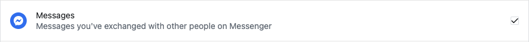
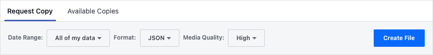

# Messenger Scraper

## Français :fr: (English [here](https://github.com/AlexBolot/messenger-scraper#english-uk-us))

### 1. Objectif
Ce code JavaScript a pour objecif d'extraire des l'ensemble des photos et vidéos envoyées et reçues dans des disscussions sur Facebook Messenger.

En se basant sur la date d'envoi des photos/vidéos, les fichiers sont renommés avec date et heure. Cela permet de retrouver de façon aproximative le moment auquel a été prise la photo/vidéo.

---

### 2. Demander l'historique à Facebook

- Se rendre sur ce lien [facebook.com/dyi/?referrer=yfi_settings](https://www.facebook.com/dyi/?referrer=yfi_settings)

- Sélectionner uniquement les messages

- Choisir le format JSON et créer le fichier

:warning:   Après cette étape il faut attendre de recevoir un  mail de Facebook indiquant que l'archive est prête.

---

### 3. Télécharger l'archive

L'archive sera probablement divisée en plusieurs dossiers d'archives `.zip`.

Placez tous les fichiers `.zip` dans le dossier `place-zip-here`.

---

### 4. Lancer le script

Pour utiliser le script vous devez avoir `Node` installé sur votre ordinateur. Trouvable [ici](https://nodejs.org/fr/download/)

Étapes à suivre : 
1. Ouvrir un terminal dans le dossier du projet
2. Taper `npm install` + entré
3. Taper `npm start` + entré

Il ne reste plus qu'à attendre, toutes les photos seront placées dans le dossier `back-up`. Cela peut prendre jusqu'à 10min.

:uk: :us:

 

---

 

## English :uk: :us: 

### 1. Project's goal

This JavaScrip code allows you to extract every photo and videos, sent or received in Facebook Messenger chats.

Based on the sent-time of the photos/videos, the files are renamed with the correct date and time. This allows you to find the approximate moment when the photo/video was taken. 

---

### 2. Request your Facebook messages history

- Follow this link [facebook.com/dyi/?referrer=yfi_settings](https://www.facebook.com/dyi/?referrer=yfi_settings)

- Only select "messages"

- Select the JSON format and create the file

:warning:   After this step, you'll have to wait until you receive the Facebook email notifying that the archive is ready.

---

### 3. Télécharger l'archive

L'archive sera probablement divisée en plusieurs dossiers d'archives `.zip`.

Placez tous les fichiers `.zip` dans le dossier `place-zip-here`.

---

### 4. Start the script

To use this script you need `Node` installed on your computer

Pour utiliser le script vous devez avoir `Node` installé sur votre ordinateur. Downloadable [here](https://nodejs.org/en/download/)

Next steps :
1. Open a terminal in the project folder
2. Type `npm install` + enter
3. Type `npm start` + enter

Now all you have to do is wait, all the photos will be placed in the `back-up` folder. This can take about 10min.
